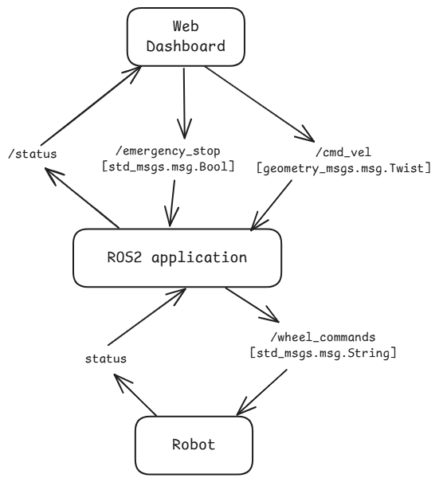

# Robotic Remote Teleoperation

- [Robotic Remote Teleoperation](#robotic-remote-teleoperation)
  - [Overview](#overview)
    - [Features list](#features-list)
  - [Requirements](#requirements)
  - [Workflow](#workflow)
    - [Robot Core](#robot-core)
    - [FastAPI Signaling / Backend](#fastapi-signaling--backend)
    - [ROS2-Web bridge](#ros2-web-bridge)
    - [Web Dashboard](#web-dashboard)
    - [Networking \& Docker Compose](#networking--docker-compose)
  - [How to use](#how-to-use)
    - [Setup](#setup)
    - [Executing](#executing)
    - [Testing](#testing)
    - [Stopping](#stopping)
  - [End-to\_end test](#end-to_end-test)
  - [Roadmap](#roadmap)
    - [Robot Core (ROS 2)](#robot-core-ros-2)
    - [Web Dashboard (React + ROSBridge/WebSocket)](#web-dashboard-react--rosbridgewebsocket)
    - [Backend / Signaling Server (FastAPI)](#backend--signaling-server-fastapi)
    - [Networking \& Security](#networking--security)
    - [Simulation \& Testing](#simulation--testing)


## Overview

A minimal, production-minded teleoperation stack for a single mobile robot. Provides a secure web dashboard that streams low-latency video, shows telemetry, and lets an authenticated operator send safe velocity commands (joystick/keyboard) with built-in safety fallbacks.

### Features list
- Secure WebRTC video streaming (signaling via WebSocket + optional TURN).
- Telemetry streaming (pose, battery, CPU/memory) to dashboard.
- Joystick + keyboard control mapped to /cmd_vel with velocity limits.
- Watchdog safety node that stops the robot if operator disconnects or no commands arrive within a timeout.
- Operator-triggered E-STOP publishing to /estop.
- Dockerized stack and demo mode using a simulator (TurtleBot3) out of the box


## Requirements

- Docker & Docker Compose (v1.29+ recommended).
- Optional: GPU support on robot host for hardware encoding (NVIDIA drivers + nvidia-container-runtime) for Jetson/desktop.
- Modern browser (Chrome/Edge/Firefox) for the dashboard.
- ROS2 distro: Jazzy or later on robot_core (sim uses compatible image).


## Workflow



### [Robot Core](robot_core/README.md)
Builds and installs a ROS2 workspace (assumes your ROS packages live under robot_core/src/) and launches a provided entrypoint (adjust launch file name).

The `robot_launch` package:
- Provides Python nodes (like status_publisher.py) which talk to robot sensors, publish state, and eventually listen to teleop commands.
- Contains a launch/ file (teleop.launch.py) that wires these nodes together into a running system.

### [FastAPI Signaling / Backend](signaling_server/README.md)
A separate container (backend) runs FastAPI app for signalling (WebSocket-based). Keep signaling logic in `signaling_server/app.py`.

Its jobs is to provide API endpoints to authenticate users, manage sessions, and act as a “signaling server” for WebRTC.

### [ROS2-Web bridge](bridge_server/README.md)
A small Python bridge that uses rclpy to subscribe/publish and forwards JSON via WebSocket to the web dashboard. Place bridge logic in `bridge_server/bridge.py`.
- Subscribes/publishes to ROS topics via rclpy or rosbridge (depending on design).
- Exposes robot status (sensor data, logs, etc.) over HTTP/WebSockets to clients.
- Receives teleop commands (e.g. velocity, button presses) from the dashboard and publishes them to ROS.

### [Web Dashboard](web_dashboard/README.md)
Multi-stage build for a React app. Serves the static build using serve on a specific port.

When you run it in Docker:
- It connects to the FastAPI backend.
- Displays live robot state (status messages, telemetry) using WebSocket streams.
- Sends teleoperation commands (joystick, keyboard, buttons) → backend → ROS topics.

### Networking & Docker Compose
The glue is your docker-compose.yml, which defines:
- robot_core → ROS 2 runtime.
- backend → FastAPI signaling/bridge.
- bridge → a ROS 2 ↔ web bridge
- web_dashboard → React UI served via Node.js/NGINX.

All services are on the same Docker network so they can talk to each other by container name.

On your host, you expose ports:
- Signaling Backend API (8000:8000). Exposed publicly so browsers can negotiate connections.
- Bridge WebSocket or REST API endpoint (9000:9000). Exposed publicly so the web dashboard can send teleop commands and receive robot telemetry.
- Dashboard web UI (3000:3000). React development server. Public entry point for the web dashboard.


## How to use

### Setup
Build dockerfiles
```sh
docker-compose build
```

### Executing
```sh
docker-compose up
docker-compose up -d  # detached
```

Open the dashboard in your browser at https://<host>:8000 (or http://localhost:3000 in local dev) and log in with the demo credentials in docs/INSTALL.md.

### Testing
```sh
docker-compose -f docker-compose.yml -f docker-compose.test.yml up
docker-compose -f docker-compose.yml -f docker-compose.test.yml up -d  # detached
```

Inspection
```sh
docker-compose run --service-ports --rm robot_core bash
```

### Stopping
```sh
docker-compose down
docker-compose down -v  # clear volumes
```


## End-to_end test
1. Start the container: `docker-compose up -d`
2. Check health endpoints:
   - `curl http://localhost:9001/health`
   - `curl http://localhost:8000/health`
3. Open the UI: `http://localhost:3000/`
4. Verify /health: `curl http://localhost:9001/health`
5. Publish from ROS2: `ros2 topic pub /status std_msgs/String "data: 'motor_ready'" -r 1` -> UI status has to change
6. Trigger from UI: `ros2 topic echo /cmd_vel_in` <- press a buttom
7. Multi-client / broadcast checks:
   1. Open a second browser window or run wscat: `wscat -c "ws://localhost:9000/?token=demo_token_123"`
   2. From the dashboard (client A) press a control or send a JSON via JS console: `{"type":"smoke","payload":{"text":"hello"}}`
   3. Expect: `both clients receive the message (bridge broadcasts to all connected clients).`


## Roadmap

### Robot Core (ROS 2)
- Command interface nodes
  - [ ] cmd_vel_subscriber.py: subscribes to /cmd_vel (geometry_msgs/Twist) to control wheels or simulated robot.
  - [ ] Optional: arm/gripper commands (/joint_states, /trajectory_commands) if you’re targeting manipulators.

- Sensor publishers
  -[ ] camera_publisher.py or integrate with ros2_image_transport (for video streaming).
  -[ ] lidar_publisher.py if you want mapping or obstacle detection.
  -[ ] IMU data (if relevant).

- Health/status nodes
  - [ ] CPU, battery, temperature monitoring (for real hardware).
  - [ ] Already started with status_publisher.

- Launch files
- [ ] teleop.launch.py: start command + status + sensors.
- [ ] simulation_launch.py: same but with Gazebo / Ignition sim backend (so you can demo without hardware).

- Telemetry
  - [ ] /robot/status — battery %, health flags
  - [ ] /robot/telemetry — CPU %, memory, temperature
  - [ ] /tf, /odom — pose/transform

### Web Dashboard (React + ROSBridge/WebSocket)
- [ ] ✅ Joystick / keyboard teleop → send cmd_vel to the robot.
- [ ] 📹 Video streaming panel → subscribe to robot camera feed.
- [ ] 📊 Status widgets → CPU, battery, connection latency.
- [ ] 🗺 Map view (optional) → visualize LIDAR / nav_msgs/OccupancyGrid.
- [ ] 🔐 Authentication → basic user login / API token for secure access.

### Backend / Signaling Server (FastAPI)
- [ ] Manages WebRTC or WebSocket signaling.
- [ ] Translates REST/WebSocket calls into ROS 2 messages via rosbridge_suite or rclpy.
- [ ] Security layer (authentication, rate limiting).
- [ ] Logging / replay of teleop sessions.

### Networking & Security
- [ ] VPN / Tailscale / Wireguard: secure connectivity between dashboard and robot.
- [ ] TLS / HTTPS: encrypt web traffic.
- [ ] Fail-safes:
  - [ ] Watchdog that stops robot if commands stop arriving. Subscribes to /cmd_vel_in (raw operator commands) and republishes to /cmd_vel after clamping and sanity checks. If no /cmd_vel_in is received for WATCHDOG_TIMEOUT_MS, publish zero velocities.
  - [ ] Emergency stop service /emergency_stop. An /estop topic that immediately triggers hardware-level stop (if available) and also sets a software-level block in the watchdog
  - [ ] Rate limiting: the bridge or signaling server should limit command frequency per operator.
  - [ ] Single-operator lock: default behavior is first-come control; add queueing or explicit lock handing for multi-user scenarios.

### Simulation & Testing
- [ ] Integrate Gazebo or Ignition with your cmd_vel + sensors.
- [ ] Provide a launch file that spins up a “simulated turtlebot-like robot” + web dashboard.
- [ ] Docker-compose profiles (sim vs real).
